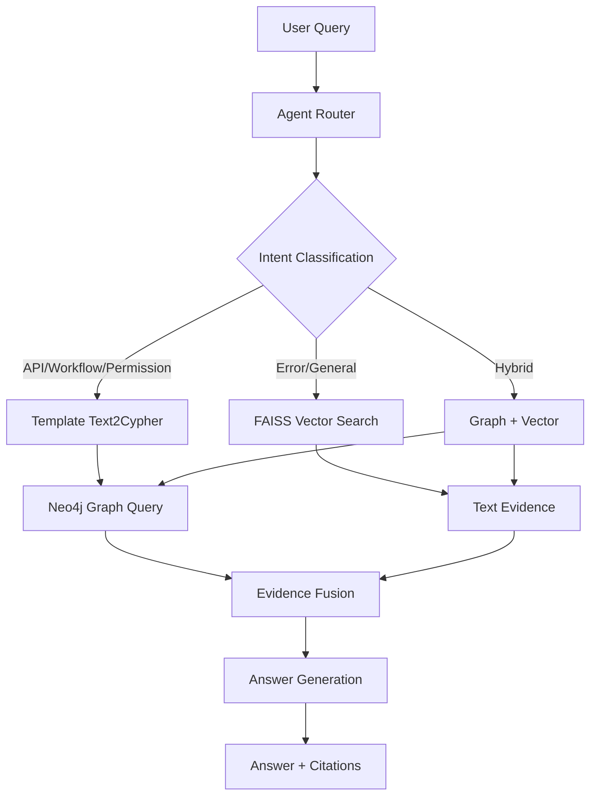

# Neo4j GraphRAG Agent

A GraphRAG agent that converts enterprise-style documents into a Neo4j knowledge graph and answers questions through hybrid graph and vector retrieval.

**[中文技术博客](docs/blog-post-cn.md)** | **[English Blog Post](docs/blog-post-en.md)**

> 🎯 **This is a portfolio project demonstrating knowledge graph modeling, GraphRAG, and agent engineering — without any LLM API key.**

## Project Highlights

This project demonstrates:
- **Ontology modeling** for enterprise documents (Module, API, Role, Permission, Workflow, Step, ErrorCode)
- **Neo4j-based knowledge graph** construction from unstructured docs
- **Template-based text2cypher** for structured reasoning (no LLM API required)
- **Hybrid GraphRAG** combining graph queries and FAISS vector retrieval
- **Agent tool calling** with automatic routing between graph, vector, and hybrid modes
- **Evaluation-ready** architecture with 27 pytest tests

## Architecture Diagram



## Quick Start

### Prerequisites

- Docker & Docker Compose
- Python 3.11+

### 1. Clone and Setup

```bash
cd neo4j-graphrag-agent
pip install -e ".[dev]"
```

### 2. Start Neo4j and API

```bash
docker compose up -d
```

- Neo4j Browser: http://localhost:7474 (login: neo4j / graphragdemo)
- API Docs: http://localhost:8000/docs

### 3. Build the Knowledge Graph

```bash
python examples/build_graph.py
```

Or via API:
```bash
curl -X POST http://localhost:8000/graph/build \
  -H "Content-Type: application/json" \
  -d '{"docs_dir": "data/raw_docs"}'
```

### 4. Ask Questions

```bash
curl -X POST http://localhost:8000/agent/ask \
  -H "Content-Type: application/json" \
  -d '{"question": "Which APIs are available in the procurement module?", "mode": "hybrid"}'
```

Or via CLI:
```bash
graphrag ask "Which APIs are available in the procurement module?"
```

## Demo Questions

| Question | Expected Mode | Why GraphRAG Wins |
|---|---|---|
| Which APIs are available in the procurement module? | graph | Exact API list from graph |
| Which roles can approve purchase orders? | graph | Role-Permission chain traversal |
| What are the steps from purchase request to inventory receiving? | graph | Workflow step chain via `NEXT_STEP` |
| Why does attachment upload fail? | hybrid | Error code + documentation |
| Which modules are involved in purchase-to-inventory conversion? | graph | Cross-module relationship query |

## Tech Stack

| Layer | Technology |
|---|---|
| Language | Python 3.11+ |
| Web API | FastAPI |
| Graph DB | Neo4j |
| Vector DB | FAISS |
| Embeddings | sentence-transformers (all-MiniLM-L6-v2) |
| CLI | Typer |
| Testing | pytest |
| Deployment | Docker Compose |

## Project Structure

```
neo4j-graphrag-agent/
├── data/raw_docs/          # Sample ERP documents
├── src/graphrag_agent/
│   ├── ingestion/          # Document loading
│   ├── ontology/           # Schema definition
│   ├── extraction/         # Rule-based entity/relation extraction
│   ├── graph/              # Neo4j client + loader + safety
│   ├── retrieval/          # Chunking + Embedding + FAISS
│   ├── text2cypher/        # Intent classifier + Cypher templates
│   ├── agent/              # Router + Tools + Answerer
│   ├── api/                # FastAPI application
│   └── cli.py              # CLI commands
├── tests/                  # pytest test suite (27 tests)
├── examples/               # Demo scripts
├── docs/                   # Blog posts (CN + EN)
└── docker-compose.yml      # Neo4j + API one-click start
```

## Testing

```bash
pytest tests/ -v
```

## API Endpoints

| Endpoint | Method | Description |
|---|---|---|
| `/health` | GET | Health check |
| `/graph/build` | POST | Build graph from documents |
| `/search/vector` | POST | Vector search |
| `/cypher/generate` | POST | Generate Cypher from question |
| `/graph/query` | POST | Execute safe Cypher query |
| `/agent/ask` | POST | GraphRAG question answering |

## Resume Description

**Neo4j GraphRAG Agent** | Python, Neo4j, Cypher, FAISS, FastAPI, Docker
- Built a GraphRAG agent that converts enterprise-style documents into a Neo4j knowledge graph and answers questions through hybrid graph and vector retrieval.
- Designed an ontology covering modules, business objects, APIs, roles, permissions, workflows, and error codes.
- Implemented template-based text2cypher, safe Cypher execution, FAISS vector search, and evidence fusion for structured enterprise QA.
- Delivered a Docker Compose deployment with FastAPI backend and comprehensive pytest test suite (27 tests).

## Why No LLM in v1?

This project intentionally avoids LLM for extraction, text2cypher, and answer generation in v1:
- **Reproducibility**: Same documents → same graph, every time
- **Zero cost**: No API keys needed, runs entirely locally
- **Testability**: Every rule has a corresponding unit test
- **Speed**: No network latency for every operation

LLM layers can be added on top of this solid foundation in future iterations.

## Future Extensions

1. **LLM-based text2cypher**: Add LLM layer on top of templates for flexible queries
2. **LLM extraction**: Complement rule-based extraction with LLM for edge cases
3. **Multi-hop reasoning**: Support complex queries spanning multiple relationship types
4. **Evaluation framework**: Design Recall@k, MRR metrics comparing Vector vs Graph vs Hybrid
5. **Web UI**: Add Gradio/Streamlit interface

## License

MIT
